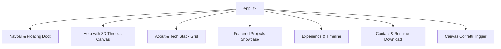

# 🚀 Harsh Kumawat — Full-Stack Developer & Quantitative Systems Portfolio

[](https://harshkumawat.com/)
[](https://react.dev/)
[](https://threejs.org/)
[](https://tailwindcss.com/)
[](https://www.framer.com/motion/)

> The primary personal portfolio website of **Harsh Kumawat**, showcasing enterprise full-stack engineering, algorithmic trading engines (STALKER), 3D interactive web applications, and UI/UX design systems.

---

## ✨ Portfolio Features

- **🌐 3D Interactive Canvas**: Built with Three.js and `@react-three/fiber` / `@react-three/drei` for engaging interactive particle backgrounds.
- **💼 Project Deep-Dives**: Interactive case studies covering algorithmic stock screeners, SaaS ERPs, 3D luxury portals, and retro web applications.
- **📄 Extracted Resume & Bio**: Downloadable PDF resume and skill matrices.
- **🎉 Interactive Micro-Interactions**: Custom celebration triggers (`canvas-confetti`), smooth navigation docks, and glassmorphic HUD elements.
- **🔍 SEO & Performance Optimized**: Complete Open Graph metadata, sitemap.xml, robots.txt, and Google Search Console verification.

---

## 🏗️ Architecture



---

## 🛠️ Tech Stack

- **Core**: React 19, Vite 8, JavaScript
- **3D & Canvas**: Three.js, React Three Fiber, React Three Drei
- **Styling**: Tailwind CSS, PostCSS, Lucide React
- **Animations**: Framer Motion 12, Canvas Confetti

---

## 🚀 Getting Started

```bash
# Clone the repository
git clone https://github.com/Harshxu/mainportfoliowebsite.git
cd mainportfoliowebsite

# Install dependencies
npm install

# Start local development server
npm run dev
```
